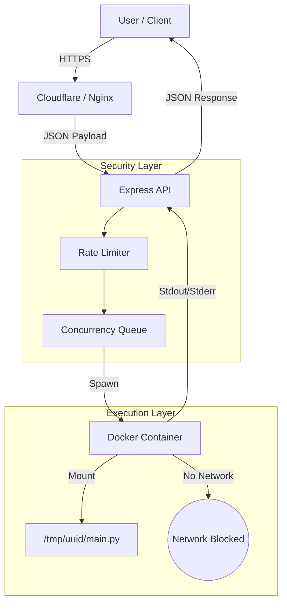

---

# ⚡ Secure Multi-Language Code Execution Engine

A high-performance, sandboxed remote code execution (RCE) microservice built with **Node.js**, **Express**, and **Docker**. Designed to safely execute untrusted user code in 10+ languages with sub-500ms latency.

Features • Architecture • Security • API • Setup

---

## 🚀 Features

* **Multi-Language Support:** Python, JavaScript, C, C++, Rust, Go, Java, C#, Ruby, PHP, Erlang, Kotlin, Typescript
* **Sandboxed Execution:** Ephemeral Docker containers with no network access (`--network none`) and strict resource limits.
* **High Performance:** Optimized **Alpine Linux** images and pre-warmed compilation chains ensure <500ms cold starts.
* **Counter-based Concurrency Control:** Limits active jobs to prevent CPU starvation.
* **Rate Limiting:** IP-based fixed-window limiting to mitigate DoS attacks.
* **Resource Isolation:** Strict memory (256MB), CPU (0.5 cores), and PID limits.

## 🛠 Architecture

The system uses a **Producer-Consumer** model where the Express API accepts jobs and spawns isolated Docker containers for execution.



## 🔒 Security Defenses

Running untrusted code is dangerous. This engine implements **Defense-in-Depth**:

1. **Network Isolation:** Containers run with `--network none`. No `curl`, `wget`, or reverse shells.
2. **Fork Bomb Protection:** `--pids-limit 64` prevents malicious recursion or process spawning attacks.
3. **Timeouts:** Strict 5-second execution limit (enforced by Node.js child process).
4. **Ephemeral Filesystem:** Code is written to a unique `/tmp` UUID directory and wiped immediately after execution.
5. **Output Sanitization:** Buffer limits prevent memory overflow attacks from large stdout streams.

## 📡 API Reference

### `POST /execute`

Executes a snippet of code in the specified language.

**Request Body:**

```json
{
  "language": "python",
  "code": "print('Hello from the sandbox!')"
}

```

**Supported Languages:**
`python`, `javascript`, `c`, `cpp`, `rust`, `go`, `java`

**Response (Success - 200):**

```json
{
  "stdout": "Hello from the sandbox!\n",
  "stderr": ""
}

```

**Response (Error - 429/503/500):**

```json
{
  "error": "Rate limit exceeded. Wait 1 min."
}

```

## 💻 Local Setup

### Prerequisites

* Node.js v18+
* Docker (Running and accessible by current user)

### 1. Clone & Install

```bash
git clone https://github.com/your-username/executor-service.git
cd executor-service
npm install

```

### 2. Pull Docker Images

You must pre-pull the images to avoid timeouts on the first run.

```bash
# Pull the base images defined in config

# Web & Scripting
docker pull python:3.11-alpine
docker pull node:18-alpine
docker pull ruby:3.2-alpine
docker pull php:8.2-fpm-alpine

# Systems & Compiled
docker pull golang:1.23-alpine
docker pull rust:1.83-alpine
docker pull gcc:12
docker pull amazoncorretto:17-alpine
docker pull mcr.microsoft.com/dotnet/sdk:8.0-alpine

# Functional
docker pull erlang:26-alpine

# Custom (TypeScript and Kotlin do not have official alpine images) 
docker build -t typescript:alpine -<<EOF
FROM node:18-alpine
RUN npm install -g typescript ts-node
EOF
docker build -t kotlin:alpine -<<EOF
FROM amazoncorretto:17-alpine
RUN apk add --no-cache bash wget unzip
RUN wget -q https://github.com/JetBrains/kotlin/releases/download/v1.9.22/kotlin-compiler-1.9.22.zip && \
    unzip kotlin-compiler-*.zip -d /opt && \
    rm kotlin-compiler-*.zip
ENV PATH=\$PATH:/opt/kotlinc/bin
EOF
```

### 3. Run Development Server

```bash
npm start
# Server running on http://localhost:3000

```

### 4. Test

```bash
curl -X POST http://localhost:3000/execute \
  -H "Content-Type: application/json" \
  -d '{ "language": "python", "code": "print(100 * 5)" }'

```

## ☁️ Deployment

### Production Checklist

1. **Trust Proxy:** Ensure `app.set('trust proxy', 1)` is enabled if behind a load balancer.
2. **User Permissions:** The Node process should run as a standard user (e.g., `ubuntu`), added to the `docker` group.
```bash
sudo usermod -aG docker ubuntu
newgrp docker

```


3. **Process Management:** Use PM2 for restarts.
```bash
pm2 start src/server.js --name executor

```


---

**License:** MIT
